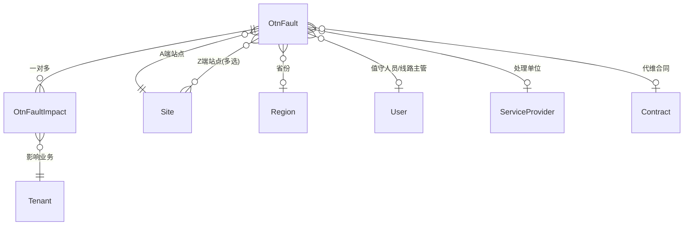

# OTN 故障管理系统 - 数据模型说明文档

## 一、模型关系概览



**核心关系**：一个故障（`OtnFault`）可能影响多个业务，每个受影响的业务记录为一条 `OtnFaultImpact`。

---

## 二、OtnFault（故障）模型

### 2.1 字段分组

#### 2.1.1 基本故障信息

| 字段名                    | 类型                  | 必填    | 说明                                        |
| ------------------------- | --------------------- | ------- | ------------------------------------------- |
| `fault_number`            | CharField(20)         | ✅ 自动 | 故障编号，格式 `FYYYYMMDDNNN`，系统自动生成 |
| `duty_officer`            | ForeignKey(User)      | ✅      | 值守人员，引用系统用户                      |
| `interruption_location_a` | ForeignKey(Site)      | ✅      | 故障位置 A 端站点                           |
| `interruption_location`   | ManyToManyField(Site) | ❌      | 故障位置 Z 端站点（可多选）                 |
| `fault_occurrence_time`   | DateTimeField         | ✅      | 故障中断时间                                |
| `fault_recovery_time`     | DateTimeField         | ❌      | 故障恢复时间                                |
| `fault_category`          | ChoiceField           | ❌      | 故障分类                                    |
| `interruption_reason`     | ChoiceField           | ❌      | 故障原因                                    |
| `fault_details`           | TextField             | ❌      | 故障详情和处理过程                          |
| `interruption_longitude`  | DecimalField(9,6)     | ❌      | 故障位置经度（GPS 坐标，十进制格式）        |
| `interruption_latitude`   | DecimalField(8,6)     | ❌      | 故障位置纬度（GPS 坐标，十进制格式）        |
| `province`                | ForeignKey(Region)    | ❌      | 省份                                        |
| `urgency`                 | ChoiceField           | ✅      | 紧急程度，默认 `low`                        |
| `first_report_source`     | ChoiceField           | ❌      | 第一报障来源                                |
| `fault_status`            | ChoiceField           | ❌      | 处理状态，默认 `processing`                 |

#### 2.1.2 光缆故障补充信息

> [!NOTE]
> 以下字段仅在故障分类为"光缆故障"时需要填写。

| 字段名                 | 类型                        | 必填 | 说明                             |
| ---------------------- | --------------------------- | ---- | -------------------------------- |
| `line_manager`         | ForeignKey(User)            | ❌   | 线路主管                         |
| `maintenance_mode`     | ChoiceField                 | ❌   | 维护方式                         |
| `handling_unit`        | ForeignKey(ServiceProvider) | ❌   | 处理单位（代维服务商）           |
| `contract`             | ForeignKey(Contract)        | ❌   | 代维合同                         |
| `dispatch_time`        | DateTimeField               | ❌   | 处理派发时间                     |
| `departure_time`       | DateTimeField               | ❌   | 维修出发时间                     |
| `arrival_time`         | DateTimeField               | ❌   | 到达现场时间                     |
| `repair_time`          | DateTimeField               | ❌   | 故障修复时间                     |
| `timeout`              | BooleanField                | ✅   | 规定时间内完成修复，默认 `False` |
| `timeout_reason`       | TextField                   | ❌   | 超时原因                         |
| `resource_type`        | ChoiceField                 | ❌   | 资源类型                         |
| `cable_route`          | ChoiceField                 | ❌   | 光缆路由属性，默认 `highway`     |
| `handler`              | CharField(100)              | ❌   | 故障处理人                       |
| `cable_break_location` | ChoiceField                 | ❌   | 光缆中断部位                     |
| `recovery_mode`        | ChoiceField                 | ❌   | 恢复方式                         |

#### 2.1.3 通用字段

| 字段名     | 类型            | 说明 |
| ---------- | --------------- | ---- |
| `tags`     | TaggableManager | 标签 |
| `comments` | TextField       | 评论 |

---

### 2.2 选择性字段选项

#### `fault_category` - 故障分类

| 键值      | 显示名称 | 颜色      |
| --------- | -------- | --------- |
| `power`   | 电力故障 | 🟠 orange |
| `fiber`   | 光缆故障 | 🔴 red    |
| `pigtail` | 空调故障 | 🔵 blue   |
| `device`  | 设备故障 | 🟢 green  |
| `other`   | 其他故障 | ⚪ gray   |

#### `urgency` - 紧急程度

| 键值     | 显示名称 | 颜色      |
| -------- | -------- | --------- |
| `high`   | 高       | 🔴 red    |
| `medium` | 中       | 🟠 orange |
| `low`    | 低       | 🟡 yellow |

#### `fault_status` - 处理状态

| 键值                 | 显示名称 | 颜色      |
| -------------------- | -------- | --------- |
| `processing`         | 处理中   | 🔴 red    |
| `temporary_recovery` | 临时恢复 | 🔵 blue   |
| `suspended`          | 挂起     | 🟡 yellow |
| `closed`             | 已关闭   | 🟢 green  |

#### `interruption_reason` - 故障原因

| 键值                     | 显示名称 |
| ------------------------ | -------- |
| `road_construction`      | 道路施工 |
| `sabotage`               | 人为破坏 |
| `line_rectification`     | 线路整改 |
| `misoperation`           | 误操作   |
| `power_supply`           | 供电故障 |
| `municipal_construction` | 市政施工 |
| `rodent_damage`          | 鼠害     |
| `natural_disaster`       | 自然灾害 |

#### `first_report_source` - 第一报障来源

| 键值                | 显示名称     |
| ------------------- | ------------ |
| `national_backbone` | 国干网网管   |
| `future_network`    | 未来网络网管 |
| `customer_support`  | 客户报障     |
| `other`             | 其他         |

#### `maintenance_mode` - 维护方式

| 键值              | 显示名称 | 颜色      |
| ----------------- | -------- | --------- |
| `outsourced`      | 代维     | 🔵 blue   |
| `coordinated`     | 协调     | 🟢 green  |
| `self_maintained` | 自维     | 🟣 purple |

#### `resource_type` - 资源类型

| 键值          | 显示名称 | 颜色      |
| ------------- | -------- | --------- |
| `self_built`  | 自建光缆 | 🟢 green  |
| `coordinated` | 协调资源 | 🔵 blue   |
| `leased`      | 租赁纤芯 | 🟣 purple |

#### `cable_route` - 光缆路由属性

| 键值          | 显示名称 | 颜色      |
| ------------- | -------- | --------- |
| `highway`     | 高速公路 | 🟢 green  |
| `non_highway` | 非高速   | 🟠 orange |

#### `cable_break_location` - 光缆中断部位

| 键值              | 显示名称 | 颜色      |
| ----------------- | -------- | --------- |
| `pigtail`         | 尾纤     | 🟡 yellow |
| `local_cable`     | 出局缆   | 🟠 orange |
| `long_haul_cable` | 长途光缆 | 🔴 red    |

#### `recovery_mode` - 恢复方式

| 键值                     | 显示名称     | 颜色          |
| ------------------------ | ------------ | ------------- |
| `fusion_splicing`        | 熔接恢复     | 🔴 red        |
| `tail_fiber_replacement` | 更换尾纤恢复 | 🟠 orange     |
| `processing`             | 处理恢复     | 🟡 yellow     |
| `fiber_adjustment`       | 调纤恢复     | 🟢 green      |
| `automatic`              | 自动恢复     | 🔵 blue       |
| `unknown`                | 无法查明     | ⚪ gray       |
| `not_provided`           | 未提供       | ⬜ light-gray |

---

### 2.3 计算属性

| 属性名            | 说明         | 计算逻辑                                                                           |
| ----------------- | ------------ | ---------------------------------------------------------------------------------- |
| `fault_duration`  | 故障持续时间 | `fault_recovery_time - fault_occurrence_time`，格式：`x天x小时x分x秒（xx.xx小时）` |
| `repair_duration` | 修复用时     | `repair_time - dispatch_time`，格式：`xx.xx小时`                                   |

---

### 2.4 业务逻辑

#### 2.4.1 时间顺序验证

模型的 `clean()` 方法确保时间字段按以下顺序排列：

```
fault_occurrence_time → dispatch_time → departure_time → arrival_time → fault_recovery_time
```

如果后续时间早于前面的时间，将抛出 `ValidationError`。

#### 2.4.2 故障编号自动生成

`save()` 方法在保存时自动生成故障编号：

- 格式：`FYYYYMMDDNNN`
- 示例：`F20251221001`（2025 年 12 月 21 日第 1 个故障）

---

## 三、OtnFaultImpact（故障影响业务）模型

### 3.1 字段说明

| 字段名                      | 类型                 | 必填 | 说明                     |
| --------------------------- | -------------------- | ---- | ------------------------ |
| `otn_fault`                 | ForeignKey(OtnFault) | ✅   | 关联故障                 |
| `impacted_service`          | ForeignKey(Tenant)   | ✅   | 影响业务（引用租户模型） |
| `service_interruption_time` | DateTimeField        | ✅   | 业务故障时间             |
| `service_recovery_time`     | DateTimeField        | ❌   | 业务恢复时间             |
| `tags`                      | TaggableManager      | ❌   | 标签                     |
| `comments`                  | TextField            | ❌   | 评论                     |

### 3.2 计算属性

| 属性名                   | 说明                 | 格式                          |
| ------------------------ | -------------------- | ----------------------------- |
| `service_duration`       | 业务中断时长         | `x天x小时x分x秒（xx.xx小时）` |
| `service_duration_hours` | 业务中断时长（小时） | `xx.xx`                       |

### 3.3 约束条件

- **唯一性约束**：`(otn_fault, impacted_service)` 组合唯一
- 同一故障下不能重复关联同一业务

---

## 四、模型总结

| 模型             | 核心功能                                   | 关联关系                                  |
| ---------------- | ------------------------------------------ | ----------------------------------------- |
| `OtnFault`       | 故障主体，记录故障的基本信息和处理过程     | 关联站点、省份、用户、服务商、合同        |
| `OtnFaultImpact` | 故障影响记录，跟踪每个受影响业务的中断情况 | 多对一关联到 `OtnFault`，关联租户（业务） |

---

## 五、附录：OtnPath（光缆路径）模型

> [!NOTE]
> 此模型用于定义光缆路径信息，与故障模型通过站点关联。

| 字段名              | 类型               | 必填 | 说明                                    |
| ------------------- | ------------------ | ---- | --------------------------------------- |
| `name`              | CharField(100)     | ✅   | 路径名称                                |
| `cable_type`        | ChoiceField        | ✅   | 光缆类型（96 芯/144 芯）                |
| `site_a`            | ForeignKey(Site)   | ✅   | A 端站点                                |
| `site_z`            | ForeignKey(Site)   | ✅   | Z 端站点                                |
| `geometry`          | JSONField          | ❌   | 空间几何数据（GeoJSON LineString 格式） |
| `calculated_length` | DecimalField(10,2) | ❌   | 计算长度（单位：米）                    |
| `description`       | TextField          | ❌   | 描述                                    |
| `comments`          | TextField          | ❌   | 评论                                    |

### `cable_type` - 光缆类型选项

| 键值  | 显示名称 | 颜色     |
| ----- | -------- | -------- |
| `96`  | 96 芯    | 🔵 blue  |
| `114` | 144 芯   | 🟢 green |
